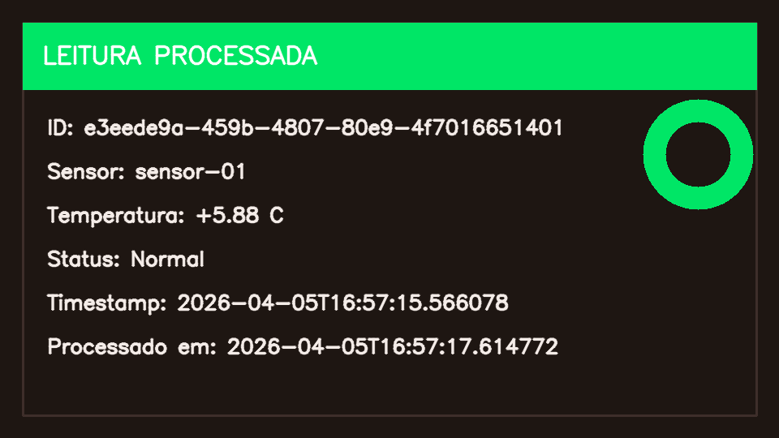
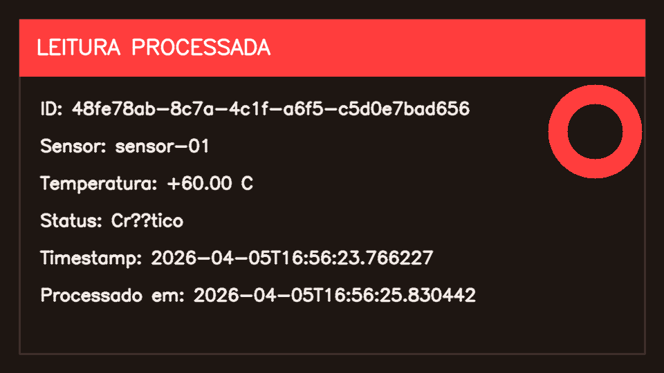
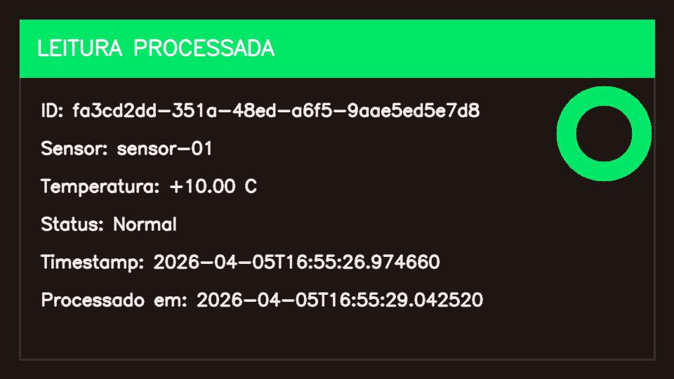

# Atividade 3 - Sistema Cliente/Servidor em Camadas

## Objetivo do Projeto
Este projeto implementa um sistema distribuído em camadas para monitoramento remoto de temperatura. O cliente envia leituras de sensor para o servidor, que valida os dados, aplica a regra de negócio, evita duplicidade e persiste o resultado em SQLite e em arquivos de evidência.

## Visão Geral da Arquitetura
- Cliente desktop: simula o sensor e envia leituras.
- API do servidor: recebe as requisições e coordena o processamento.
- Banco de dados: guarda o histórico das leituras.
- Regras de negócio: classificam a temperatura em Normal, Alerta ou Crítico.
- Persistência em arquivos: grava JSON e PNG de cada leitura processada.
- Execução em produção: usa Waitress para subir a API.

## Estrutura do Projeto
```text
frontend/
└── app.py              # 🖥️ Cliente Tkinter: simula o sensor, envia leituras e mostra histórico/status

backend/
├── app.py              # ✅ Coração da API: recebe requisições, valida o JSON, aplica idempotência e chama as outras camadas
├── database.py         # 💾 Gerencia o SQLite: cria a tabela, consulta por id e salva leituras
├── rules.py            # 📊 Regras de negócio: classifica a temperatura em Normal, Alerta ou Crítico
├── storage.py          # 🗂️ Persistência em disco: salva JSON e gera PNG com OpenCV
├── run_server.py       # 🚀 Inicialização em produção: sobe a API com Waitress
├── data/               # 📦 Pasta do banco de dados
│   └── leituras.db     # 💿 Banco SQLite criado automaticamente
└── storage/            # 📁 Pasta dos arquivos gerados
    └── leituras/       # 🖼️ Cada leitura salva aqui como JSON e PNG
        ├── uuid.json
        └── uuid.png
```

## Função de Cada Arquivo
| Arquivo | Função |
|---|---|
| [frontend/app.py](frontend/app.py) | Interface Tkinter do cliente. Gera leituras manuais ou automáticas, envia para o servidor e mostra histórico e status. |
| [backend/app.py](backend/app.py) | API Flask. Expõe as rotas, valida payload, verifica duplicidade e orquestra o processamento. |
| [backend/database.py](backend/database.py) | Acesso ao SQLite. Cria a tabela, consulta leitura por id e insere novos registros. |
| [backend/rules.py](backend/rules.py) | Regra de negócio pura. Classifica a temperatura com base nos limites definidos. |
| [backend/storage.py](backend/storage.py) | Persistência em disco. Salva JSON e gera PNG com OpenCV para cada leitura processada. |
| [backend/run_server.py](backend/run_server.py) | Entrada de execução em produção. Inicializa o banco e sobe o servidor com Waitress. |
| [README.md](README.md) | Documento de visão geral, execução, estrutura e evidências. |
| [requirements.txt](requirements.txt) | Dependências do projeto. |

## Fluxo de Execução
1. O cliente gera uma leitura com `id` (UUID), `sensor_id`, `temperatura` e `timestamp` em ISO 8601.
2. O cliente envia um `POST` para `/leitura`.
3. O servidor valida o JSON, os campos obrigatórios, o UUID, a temperatura numérica e o timestamp.
4. O servidor consulta o banco para garantir idempotência.
5. Se a leitura já existir, ele retorna `duplicado = True` e não grava novamente.
6. Se a leitura for nova, o servidor classifica o status lógico.
7. O servidor grava a leitura no SQLite.
8. O servidor salva o JSON e gera um PNG com OpenCV em `backend/storage/leituras/`.
9. O servidor responde com os dados processados para o cliente atualizar a interface.

## Regras de Negócio
- Temperatura maior que 15: `Crítico`
- Temperatura maior que 10: `Alerta`
- Caso contrário: `Normal`

## Persistência
### SQLite
A tabela `leituras` possui os campos:
- `id` (`TEXT`, chave primária)
- `sensor_id` (`TEXT`)
- `temperatura` (`REAL`)
- `status_logico` (`TEXT`)
- `timestamp` (`TEXT`)

### Arquivos Gerados
Para cada leitura processada, o backend grava:
- um arquivo JSON com os dados processados;
- um arquivo PNG com a representação visual da leitura.

## Como Executar
### 1. Instalar dependências
```bash
pip install -r requirements.txt
```

### 2. Subir o servidor
```bash
python backend/run_server.py
```

### 3. Abrir o cliente
```bash
python frontend/app.py
```

### 4. Configurar a URL no cliente
No campo de URL do cliente, use o endereço do servidor no formato:
```text
http://IP_DO_SERVIDOR:5000/leitura
```

## Evidências de Execução
O projeto gera arquivos de evidência automaticamente em `backend/storage/leituras/`.

### Exemplo de leitura normal


### Exemplo de leitura em crítico


### Exemplo de leitura automática


## Evidências Manuais da Execução
Para a entrega da atividade, os prints mais importantes são estes:
- terminal 1: servidor Flask/Waitress em execução;
- terminal 2: health check com `Invoke-RestMethod`;
- terminal 3: cliente Tkinter em execução;
- interface com leitura manual;
- interface com envio automático.

Se você quiser, pode salvar esses prints em uma pasta como `docs/imagens/` e trocar este trecho por imagens do seu próprio teste.

## Dependências
- Flask
- requests
- waitress
- opencv-python
- numpy

## Observações
- O sistema evita leituras duplicadas usando o UUID como chave primária.
- O backend retorna `201` para leituras novas e `200` para leituras já processadas.
- O servidor roda em `0.0.0.0:5000`, então pode ser acessado por outros dispositivos na rede.

## Exemplo de Execução:


Aqui apenas abri o aplicativo!


Veja que inseri um teste manual onde o resultado foi normal.


Aqui inseri outro teste manual onde o resultado foi crítico, pois a regra de negócio diz que temperatura > 15°C = Crítico.


Já aqui coloquei para inserir valores aleatórios. Perceba que ele está seguindo as regras de negócio da forma que foi projetado, utilizando Normal, Alerta e Crítico.
